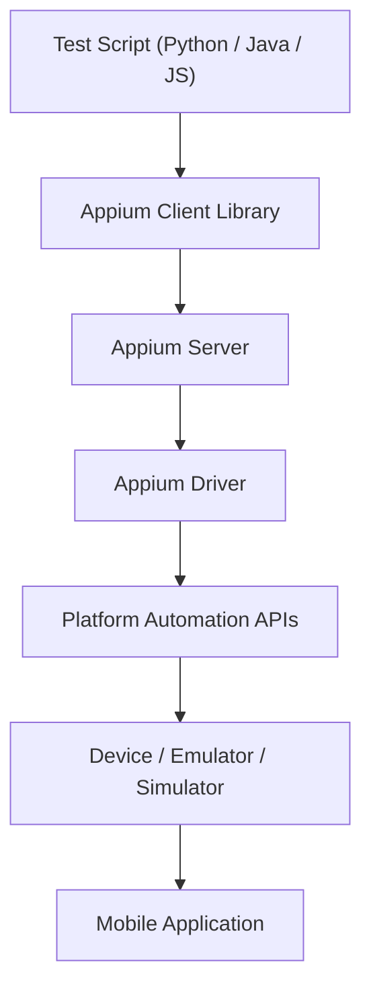

# Appium Setup on macOS (Apple Silicon)

> **Disclaimer:** This repository contains example software documentation created for a Technical Writing portfolio.  
> It is not affiliated with or endorsed by the Appium project, Apple, Google, or any related organizations.  
> This guide is intended for educational and demonstration purposes only.  
> Some instructions may become outdated as tools, operating systems, or dependencies evolve.
>
> **Read Time:** 6–10 minutes


A **step-by-step guide for installing and configuring Appium on macOS** for **iOS and Android mobile automation testing**.

This repository is part of a **QA Automation / Technical Writing portfolio**, demonstrating how to document complex developer tooling using **clear, structured, beginner-friendly technical documentation**.

---

# Table of Contents

- [Quick Start](#quick-start)
- [Architecture Overview](#appium-architecture-overview)
- [Supported Environment](#supported-environment)
- [System Requirements](#system-requirements)
- [Prerequisites](#prerequisites)
- [Installation Guide](#installation-guide)
- [iOS Environment Setup](#ios-environment-setup)
- [Android Environment Setup](#android-environment-setup)
- [Configure Environment Variables](#configure-environment-variables)
- [Verify Installation](#verify-installation)
- [Python Validation Script](#python-validation-script)
- [Troubleshooting](#troubleshooting)
- [Useful Resources](#useful-resources)

---

# Quick Start

> For experienced users who have Homebrew and Xcode already installed.
> If this is your first time setting up Appium, skip to the [Installation Guide](#installation-guide).
```bash
# Install Node.js via NVM
brew install nvm && mkdir ~/.nvm
echo 'export NVM_DIR="$HOME/.nvm"' >> ~/.zshrc
echo 'source $(brew --prefix nvm)/nvm.sh' >> ~/.zshrc
source ~/.zshrc
nvm install --lts

# Install Appium and drivers
npm install -g appium
appium driver install xcuitest
appium driver install uiautomator2

# Verify
npx appium-doctor
```

> **Expected result:** Appium Doctor reports all required dependencies as satisfied.
> Start the server with `appium` and proceed to [Verify Installation](#verify-installation).
---

# Appium Architecture Overview



### Architecture Explanation

| Component | Description |
|----------|-------------|
| Test Script | Automation tests written in Python, Java, or JS |
| Client Library | Sends automation commands |
| Appium Server | Processes automation requests |
| Driver | Platform driver (XCUITest / UIAutomator2) |
| Platform APIs | iOS or Android automation frameworks |
| Device | Emulator, simulator, or real device |
| App | Application under test |

---

# Supported Environment

| Component | Requirement |
|-----------|-------------|
| macOS | Any recent version |
| Architecture | Apple Silicon (M1 / M2 / M3 / newer) |
| Appium | Latest stable version |
| Node.js | Managed via NVM |
| Platforms | iOS and Android |

Check macOS version:

```bash
sw_vers
```

Update macOS if necessary:

```
System Settings → General → Software Update
```

---

# System Requirements

| Requirement | Details |
|-------------|--------|
| RAM | Minimum 8 GB |
| Disk Space | Minimum 20 GB |
| Internet | Required for downloading dependencies |

---

# Prerequisites

| Tool | Purpose |
|-----|--------|
| Homebrew | macOS package manager |
| NVM | Node version manager |
| Node.js | Runtime for Appium |
| Xcode | Required for iOS automation |
| Android Studio | Required for Android automation |

---

# Installation Guide

Follow these steps if you are setting up Appium for the first time.
Each section includes verification steps to confirm a successful install
before moving to the next dependency.

> **Tip:** Complete each section in order — later steps depend on earlier ones.
<details>
<summary><strong>Install Homebrew</strong></summary>

```bash
/bin/bash -c "$(curl -fsSL https://raw.githubusercontent.com/Homebrew/install/HEAD/install.sh)"
```

Verify installation:

```bash
brew --version
```

</details>

---

<details>
<summary><strong>Install Node.js Using NVM</strong></summary>

Install NVM:

```bash
brew install nvm
```

Create the NVM working directory — NVM stores Node.js versions here:
```bash
mkdir ~/.nvm
```

Add NVM to your shell profile so it loads automatically in every new terminal session.
Open your shell configuration file:
```bash
nano ~/.zshrc
```

Add the following lines — the first tells your shell where NVM lives,
the second activates it:
```bash
export NVM_DIR="$HOME/.nvm"
source $(brew --prefix nvm)/nvm.sh
```

Reload shell:

```bash
source ~/.zshrc
```

Install Node.js:

```bash
nvm install --lts
```

Verify installation:

```bash
node -v
npm -v
```

</details>

---

<details>
<summary><strong>Install Appium</strong></summary>

```bash
npm install -g appium
```

Verify installation:

```bash
appium -v
```

Run doctor:

```bash
npx appium-doctor
```

</details>

---

<details>
<summary><strong>Install Appium Drivers</strong></summary>

List drivers:

```bash
appium driver list --updates
```

Install iOS driver:

```bash
appium driver install xcuitest
```

Install Android driver:

```bash
appium driver install uiautomator2
```

Verify installation:

```bash
appium driver list --installed
```

</details>

---

# iOS Environment Setup

Install **Xcode** from the Mac App Store.

Verify installation:

```bash
xcode-select -p
```

Accept license:

```bash
sudo xcodebuild -license accept
```

Install command line tools:

```bash
xcode-select --install
```

List simulators:

```bash
xcrun simctl list devices
```

Verify your simulators are listed correctly. You should see output similar to:
```
== Devices ==
-- iOS 17.0 --
    iPhone 15 (XXXXXXXX-XXXX-XXXX-XXXX-XXXXXXXXXXXX) (Shutdown)
    iPhone 15 Pro (XXXXXXXX-XXXX-XXXX-XXXX-XXXXXXXXXXXX) (Shutdown)
-- iOS 16.4 --
    iPhone 14 (XXXXXXXX-XXXX-XXXX-XXXX-XXXXXXXXXXXX) (Shutdown)
```

> **Note:** If no devices appear, open Xcode → **Settings → Platforms** and download at least one iOS Simulator runtime.

---

# Android Environment Setup

Download Android Studio:

https://developer.android.com/studio

Install components:

- Android SDK
- Android SDK Platform Tools
- Android Emulator
- Android SDK Build Tools

Verify ADB:

```bash
adb version
```

Check devices:

```bash
adb devices
```

Verify your emulator is detected by ADB. After launching an emulator from Android Studio,
run:
```bash
adb devices
```

You should see output similar to:
```
List of devices attached
emulator-5554   device
```

> **Note:** If the emulator shows as `offline` instead of `device`, run `adb kill-server`
> followed by `adb start-server` to reset the connection.

---

# Configure Environment Variables

These variables tell your system where the Android SDK is installed so that
tools like `adb` and the emulator can be called from any terminal window.

Open your shell profile:
```bash
nano ~/.zshrc
```

Add the following — each `PATH` line exposes a different set of Android tools
to your terminal:
```bash
export ANDROID_HOME=$HOME/Library/Android/sdk
export PATH=$ANDROID_HOME/emulator:$PATH
export PATH=$ANDROID_HOME/platform-tools:$PATH
export PATH=$ANDROID_HOME/tools:$PATH
```

Reload shell:

```bash
source ~/.zshrc
```

---

# Verify Installation

Start Appium:

```bash
appium
```

Expected output:

```
Appium REST http interface listener started
```

Verify drivers:

```bash
appium driver list --installed
```

Run doctor:

```bash
npx appium-doctor
```

---

# Python Validation Script

This script verifies your Appium setup by launching the Android Settings app on an emulator.
It uses the Appium 2.x `AppiumOptions` style, the older dictionary-based capabilities format
is no longer supported in Appium 2.x.

**Prerequisites:** Ensure your Android emulator is running before executing this script.

Install the Python client:
```bash
pip install Appium-Python-Client
```

Example script (`scripts/python/test_appium.py`):
```python
from appium import webdriver
from appium.options import UiAutomator2Options

# Define device and app capabilities using Appium 2.x AppiumOptions
options = UiAutomator2Options()
options.platform_name = "Android"
options.device_name = "Android Emulator"
options.app_package = "com.android.settings"
options.app_activity = ".Settings"

try:
    # Connect to the running Appium server
    driver = webdriver.Remote("http://127.0.0.1:4723", options=options)
    print("App launched successfully!")
finally:
    # Always quit the driver to release the session
    driver.quit()
    print("Driver session closed.")
```

Run the script:
```bash
python scripts/python/test_appium.py
```

Expected output:
```
App launched successfully!
Driver session closed.
```

> **Note:** If you see `AttributeError: module 'appium.options' has no attribute 'UiAutomator2Options'`,
> upgrade your client: `pip install --upgrade Appium-Python-Client`

---

# Troubleshooting

<details>
<summary>Node Version Issues</summary>

```bash
node -v
```

Switch version:

```bash
nvm use --lts
```

</details>

---

<details>
<summary>Android Device Not Detected</summary>

Restart ADB:

```bash
adb kill-server
adb start-server
```

Verify device:

```bash
adb devices
```

</details>

---

<details>
<summary>Appium Doctor Errors</summary>

```bash
npx appium-doctor
```

Follow recommended fixes.

</details>

---

# Useful Resources

Appium Documentation  
https://appium.io/docs/en/latest/

Android Developer Documentation  
https://developer.android.com

Apple Developer Documentation  
https://developer.apple.com

---

# About This Repository

This repository is part of a **QA Automation / Technical Writing portfolio**.

It demonstrates:

- structured developer documentation
- beginner-friendly explanations
- reproducible environment setup
- validation through automation scripts

---

# License

This repository is provided for **educational and portfolio purposes**.
