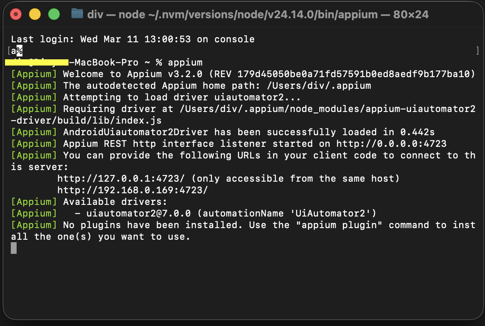

# Start the Appium Server

This guide covers starting the Appium server, verifying it is running correctly,
and understanding the key startup flags available for customization.

**Prerequisite:** Appium drivers must be installed. See [Install Drivers](install-drivers.md).

---

## Start the Server

Start Appium with default settings (port 4723, localhost):

```bash
appium
```

Expected output:

```
[Appium] Welcome to Appium v3.x.x
[Appium] Appium REST http interface listener started on http://127.0.0.1:4723
```

> **Note:** The server runs in the foreground and occupies the terminal session.
> Open a separate terminal window to run tests while the server is active.

---

## Verify the Server is Running

From a separate terminal window, send a status request to the server:

```bash
curl http://127.0.0.1:4723/status
```

Expected output:

```json
{
  "value": {
    "ready": true,
    "message": "The server is ready to accept new connections",
    "build": {
      "version": "3.x.x"
    }
  }
}
```

A `"ready": true` response confirms the server is accepting connections.

---

## Server Screenshot

The following shows the Appium server running successfully in terminal:



---

## Common Startup Flags

| Flag | Default | Purpose |
|---|---|---|
| `--port` | `4723` | Change the port the server listens on |
| `--address` | `127.0.0.1` | Bind to a specific network address |
| `--log` | stdout | Write logs to a file |
| `--log-level` | `info` | Set verbosity (`debug`, `info`, `warn`, `error`) |
| `--relaxed-security` | `false` | Enable less-secure features for local testing |

Example — start on a custom port with debug logging:

```bash
appium --port 4800 --log-level debug
```

Example — log output to a file for debugging:

```bash
appium --log ~/appium.log
```

---

## Run Appium Doctor Before Testing

Before running your first test session, confirm all dependencies are satisfied:

```bash
npx appium-doctor
```

Resolve any ✖ errors before proceeding. Warnings (⚠) are non-blocking but
should be reviewed.

---

## Stop the Server

Press `Ctrl+C` in the terminal where Appium is running to stop the server gracefully.

---

## Next Step

Proceed to the [Troubleshooting](troubleshooting.md) guide if you encounter issues,
or return to the [README](../README.md) to run the Python validation script.
